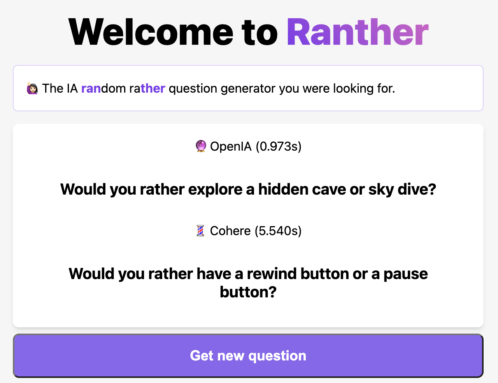

# Ranther

 
Ranther  is a great way to start a conversation, and this repo makes it easy to do just that. Simply press the button, and you'll see a random "Would you rather" question. The question are generated by IA,  so you'll never run out of this kind of question. You can use these questions to start a conversation, break the ice, or just have some fun!
 
 

🕣 May <strong>take a little while</strong> because I'm using <strong>co:here</strong> free trial API key. <a href="https://cohere.ai/">Get yours!</a>

 

## 👇 Disclaimer
I tried to ask for generic and not invasive or too personal question, but if a question make you feel uncomfortable, I apologize in advance, it not was my intention. This is a fun and non pretentious project.

## 🙏 Contributing
If you would like to contribute to Ranther, please feel free to submit a pull request. We welcome contributions of all kinds, improving the code, or fixing a bug. To get started, fork this repository and make your changes on a new branch. Once you've made your changes, submit a pull request and we'll review your changes as soon as possible.

## 🔖 License
Ranther is licensed under the MIT License. Feel free to use, modify, and distribute the code as you see fit. We only ask that you provide attribution to the original project and maintain the same license terms for any derivative works.